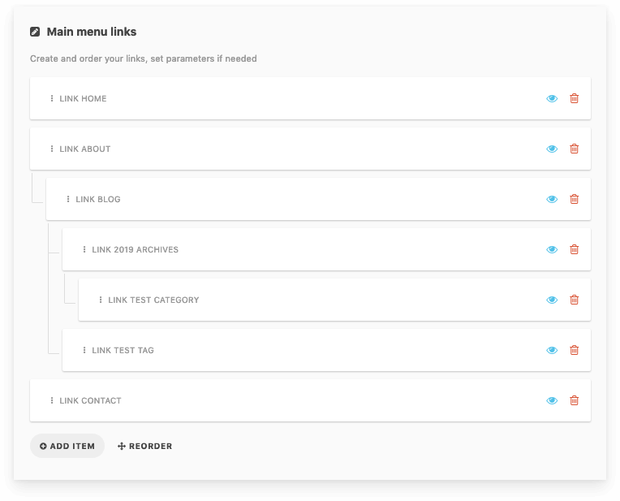
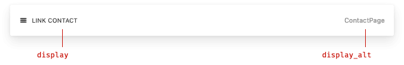

# field-nestable

Nestable field type for [Cockpit CMS](https://github.com/agentejo/cockpit)

This is mostly the same as a repeater field, but each field can be nested.



## Installation

```
$ cd cockpit/modules/addons
$ git clone git@github.com:DrMartinGonzo/field-nestable.git
```

_Note: Directory must be named **field-nestable** for Cockpit to register addon._

## Options

### Differences with repeater field

⚠️ Doesn't support field chooser like repeater field.

Rest of config is the same as with repeater field. But you can set two different properties for displaying info: `display` and `display_alt`.



### Sample config

```json5
{
  limit: 7, // max number of items that can be added
  field: {
    type: 'text', // type of field to repeat
    label: 'Text field', // Field label
    options: {
      display: 'title', // value to display (next to label)
      display_alt: 'route_name', // value to display (bottom right of card, when in sorting mode)
    },
  },
}
```

`display` and `display_alt` properties can also be set directly on nestable field and will override properties set on child field:

```json5
{
  limit: 7, // max number of items that can be added
  display: 'title', // value to display (next to label)
  display_alt: 'route_name', // value to display (bottom right of card, when in sorting mode)
  field: {
    type: 'text', // type of field to repeat
    label: 'Text field', // Field label
    options: {},
  },
}
```

## Sample response structure :

For items nested like this:

```
- item 1
- item 2
  │
  └ item 2-1
    │
    └ item 2-1-1
      │
      └ item 2-1-1-1
- item 3
```

Response will look like:

```json
{
  "test": [
    {
      "field": {},
      "value": {}
    },

    {
      "field": {},
      "value": {},

      "children": [
        {
          "field": {},
          "value": {},

          "children": [
            {
              "field": {},
              "value": {},

              "children": [
                {
                  "field": {},
                  "value": {}
                }
              ]
            },

            {
              "field": {},
              "value": {}
            }
          ]
        }
      ]
    },

    {
      "field": {},
      "value": {}
    }
  ]
}
```
